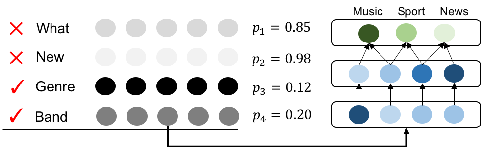
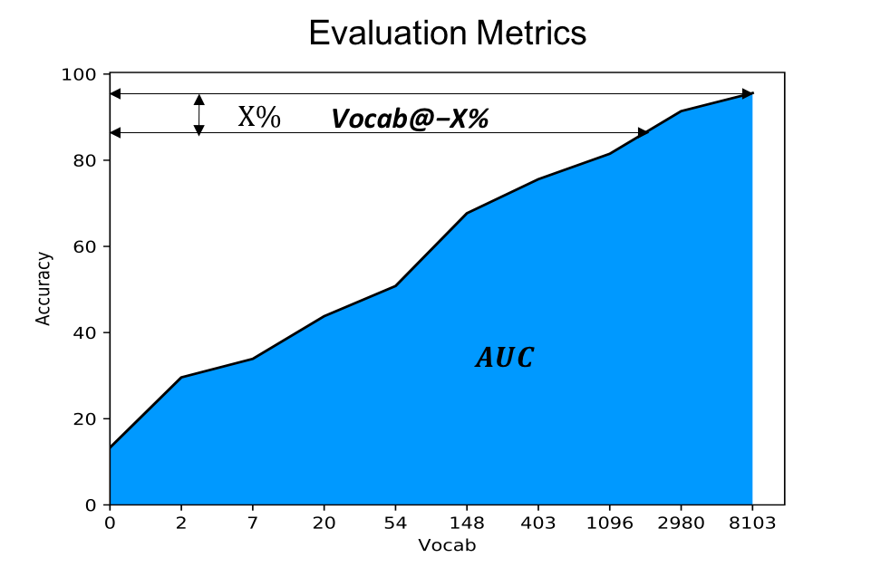
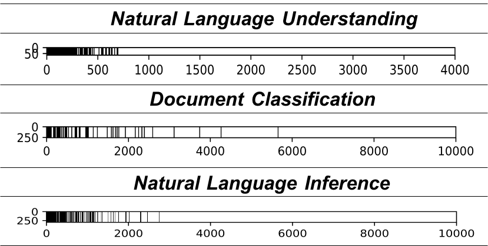

# Variational-Vocabulary-Selection
Code and Data for NAACL19 Long Oral Paper ["How Large a Vocabulary Does Text Classification Need? A Variational Approach to Vocabulary Selection"](https://arxiv.org/abs/1902.10339).

**If you have any question about the code, please do not hesitate to send me an email or leave a github issue.**

## Overview
- The algorithm is based variational dropout algorithm to view the embedding matrix as a Bayesian neural network, and associate each row of the embedding matrix with a dropout probability p, if the dropout probability is greater than a certain threshold, the word can be dropped out without hurting the performance. An example shows document classification, the categories are music, sports, news. Ideally, the unrelated words like "what, new" should have very low correlation, thus associated with a high dropout probability.


- Evaluation Metric: we adopt the area under curve (greater is better) and vocabulary size under 3% accuracy drop (smaller is better) for evaluation.


- We demonstrate some visualization of embedding matrix below, the black lines represents the remained words. In general, the words with higher frequency is kept, but it's not exactly overlapping with frequency-based method.


## Requirements:
- Python 2.7
- Tensorflow 1.90
- Pandas
- Sklearn
- Matplotlib

## Dataset Download
Download the train/val/test data from [Google Drive](https://drive.google.com/open?id=19hAnqpeJRf8UX4_5q93_eMCUiqteMdna), please put the dataset folders in the repo's root directory.


## Model Training
train.py parameters are listed as follows:
```
1. --model, which model you are using, we provide RNN and CNN models
2. --id, the name of the model you will be saving in the directory, it needs to match during evaluation
3. --variational, a switch, on means using VVD mode
4. --l1, a switch, on means using l1 mode
5. --dataset, choose a dataset from the the above four (ag_news|dbpedia|sogou|yelp_review)
6. --emb_size, setting the embedding dimension
7. --cutoff, the default is None, which means all the words will be remained in the vocabulary, N means the top N frequent words are remained the vocabulary
```

### Core Class: the variational dropout embedding
```
class VarDropoutEmbedding(object):
    def __init__(self, input_size, layer_size, batch_size, name="embedding"):
        self.name = name
        self.input_size = input_size
        self.layer_size = layer_size
        self.batch_size = batch_size
        self.logdropout_init = tf.random_uniform_initializer(0, 3)
        # Mean value of the word embedding
        self.embedding_mean = tf.get_variable(name, [self.input_size, self.layer_size])
        # Dropout ratio of the word embedding for each row
        self.embedding_logdropout_ratio = tf.get_variable(name + "_ratio", [self.input_size, 1], initializer=self.logdropout_init)
        self.eps = tf.random_normal([self.batch_size, 1, self.layer_size], 0.0, 1.0)      

    def __call__(self, input_data, sample=False, mask=None):
        if sample:
            # use the re-parameterization trick during training
            output_mean = tf.nn.embedding_lookup(self.embedding_mean, input_data)
            output_logdropout = tf.nn.embedding_lookup(self.clip(self.embedding_logdropout_ratio), input_data)
            output_std = tf.exp(0.5 * output_logdropout) * output_mean
            output = output_mean + output_std * self.eps
        elif mask is None:
            # baseline l1 regularization
            output = tf.nn.embedding_lookup(self.clip(self.embedding_mean), input_data)
        else:
            # use the vocabulary dropout mask to drop useless words during test time
            output = tf.nn.embedding_lookup(mask * self.clip(self.embedding_mean), input_data)

        return output

    def clip(self, mtx, to=10):
        return tf.clip_by_value(mtx, -to, to)

    def zeroed_embedding(self, mask):
        return self.embedding_mean * mask
    
    def l1_norm(self):
        # Obtain the L1 norm
        t = tf.square(self.embedding_mean)
        t = tf.reduce_sum(t, axis=-1) + tf.constant(1.0e-8)
        t = tf.sqrt(t)
        reg = tf.reduce_sum(t)
        return reg

    def rowwise_norm(self):
        # Obtain the L1 norm for each word
        t = tf.square(self.embedding_mean)
        t = tf.reduce_sum(t, axis=-1) + tf.constant(1.0e-8)
        t = tf.sqrt(t)
        return t

    def regularizer(self):
        # Obtain the regularization loss function
        k1, k2, k3 = 0.63576, 1.8732, 1.48695
        log_alpha = self.clip(self.embedding_logdropout_ratio)
        KLD = -tf.reduce_sum(k1 * tf.sigmoid(k2 + k3 * log_alpha) - 0.5 * tf.nn.softplus(-log_alpha) - k1)
        return KLD 
```
### Baseline:
- Train word-level CNN Model:
```
python train.py --model=word_cnn --id=word_cnn_cutoff --cutoff 10000 --dataset=ag_news
```

- Evaluate Frequency-based CNN Model:
```
python train.py --model=word_cnn --id=word_cnn_cutoff --dataset=ag_news --cutoff 10000 --compress
```

### Variational Vocabulary Dropout:
- Train VVD CNN Model (--cutoff parameter can be left out):
```
python train.py --model=word_cnn --id=word_cnn_cutoff --dataset=ag_news --cutoff 10000 --compress --variational
```
- Evaluate VVD CNN Model (--cutoff parameter can be left out), it needs to be consistent with trained id:
```
python train.py --model=word_cnn --id=word_cnn_cutoff --dataset=ag_news --cutoff 10000 --compress --variational
```

### Tips:
- Note that --cutoff 10000 is an optional argument, it will first cut off the vocabulary to remain first 10K and then perform variational dropout, if you leave it out, the model will start scratch from the huge vocabulary. They are both ending at the same point. The difference only lies in the convergence time.
- For VVD Training, you can stop when the accuracy reaches the maximum, do not wait until it drops too much.
- Tunning the decay parameters will probably harvest better ACC-VOCAB AUC scores.


## Reproducibility
- Download the pre-trained models from [Google Drive](https://drive.google.com/file/d/14cfa_QUHleRbndkDgcsawYlbXfkXpG8q/view?usp=sharing), please untar the files into the repo's root directory.

- Untar it into "dataset/architecture_cutoff N_dim_variational/" (like ag_news/word_cnn_cutoff10000_256_variational) folders. You can directly reload the model for evaluation to compute the propose metrics (AUC and Vocab @-X%), an example is shown below:
```
python train.py --model=word_cnn --id=word_cnn_cutoff10000 --dataset=ag_news --cutoff 10000 --compress --variational
```

## Acknowledgement:
We gratefully thank Yandex for sharing their code on [variational dropout](https://github.com/senya-ashukha/variational-dropout-sparsifies-dnn).
